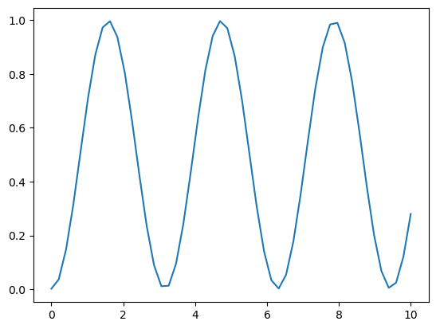

En esta parte explicaremos paso a paso cómo revolver un ejemplo de un problema dinámico de valor inicial utilizando el método RK4 en python.

Teniendo como operador O una matriz 2x2 como la siguiente:

$$ \left( \begin{array}{ll} 0 & 1 \\ 1 & 0 \end{array} \right) $$

Cuyo código en python sería el siguiente:

``` py
Operador = np.array([[0, 1], [1, 0]])
```

Podemos notar que dicho operador no es diagonal, por lo cual se espera que conforme avance el tiempo el operador modifica el estado y(t).


Seguidamente se define un estado inicial , dicho estado puede representar cantidades físicas de un sistema. Consideramos como estado inicial una matriz 2x2 dada por:

$$ \left( \begin{array}{ll} 0 & 0 \\ 0 & 1 \end{array} \right) $$

Cuyo código en python estaría dado por:

``` py
yinicial = np.array([[0,0],[0,1]])
```

Ahora implementamos la función f(y,t), lo cuál en Python se realiza de la siguiente forma:

``` py
def dyn_generator(oper, state):
    return (-1.0j)*(np.dot(oper,state)-np.dot(state,oper))
```

También implementamos la función que realiza la operación dinámica en python con el método RK4:

``` py
def rk4(func, oper, state, h):
    k_1 = h * func(oper , state)
    k_2 = h * func(oper , state + (k_1)/(2))
    k_3 = h * func(oper , state + (k_2)/(2))
    k_4 = h * func(oper , state + k_3)
    return state + 1/(6) * (k_1 + 2 * k_2 + 2* k_3 + k_4)
```

Teniendo estas dos funciones ahora podemos evaluar la dinámica temporal de una grilla temporal unidimensional. Utilizando la función np.linspace creamos un arreglo de valores temporales:

``` py
times = np.linspace(0.0,10.0,50)
```

Este código anterior nos da una lista de 50 valores que inician en 0 y terminan en 10, siendo estos los diferentes tiempos a considerar.

Ahora necesitamos definirle un valor a h:

``` py
h = times[1] - times [0]
```
Siendo h la separación entre cada valor de tiempo.

Creamos una rutina para realizar la evolución temporal. Para ellos primero creamos una copia del operador que representa el valor inicial:

``` py
ycopy = yinicial.copy()
```

Y luego llamamos la rutina rk4, calculando el estado del sistema y(t) a través del tiempo y vamos a guardar la entrada (0,0) y (0,1) de la matriz y(t). Para esto vamos a inicializar dos arreglos que van a contener los valores con valores iniciales cero, utilizando el mismo tamaño del arreglo que contiene la variable independiente temporal:

``` py
stateQuant00 = np.zeros(times.size)
stateQuant11 = np.zeros(times.size)
```
**Realizamos la rutina principal que realiza la evolución temporal**
Para ello primero guardamos los valores de las entradas de yinicial (0,0) y (1,1) en los arreglos que definimos:

``` py
stateQuant00[tt] = ycopy[0,0].real
stateQuant11[tt] = ycopy[1,1].real
```

Luego invocamos rk4 operando sobre yinicial y devolvemos el resultado a una nueva variable yN

``` py
yN = rk4(dyn_generator,operador,ycopy, h)
```

Después asignamos yN a yinicial:

``` py
ycopy = yN
```

De esta manera, en la siguente iteracción, el operador de esta iteracción se convierte en el inicial de la siguiente iteración.

Podemos graficar estos resultados utilizando matplotlib:

``` py
plt.plot(times,stateQuant00)
```

